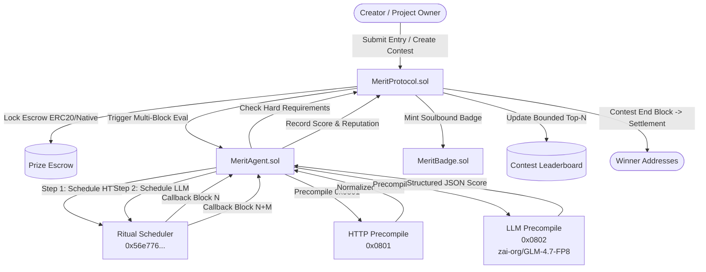

# Merit Protocol — AI-Powered Web3 Reputation & Creator Contest Infrastructure

> **Tagline:** Projects define the rules. Creators contribute. AI evaluates. Contracts reward.

Deployed on **Ritual Testnet (Chain ID 1979)**.

---

## 1. Product Vision

Merit Protocol is an AI-powered contribution, reputation, role progression, contest, and reward infrastructure built for Web3 communities.

The protocol delivers two core products sharing one reputation layer:

### Product A — Contribution Reputation
Projects define transparent contribution programs. Creators submit content (X threads, tutorials, videos, articles, research). 
- Objective hard requirements (mentions, word count, hashtags, media) are verified deterministically.
- Quality is evaluated by Ritual LLM precompiles (`0x0802`) using structured rubrics (relevance, accuracy, originality, clarity, usefulness, creativity).
- Reputation points accrue deterministically and automatically unlock non-transferable (soulbound) ERC-721 `MeritBadge` NFTs without manual admin intervention.

### Product B — Autonomous Creator Contests
Projects lock ERC-20 (or RITUAL) prize pools when creating contests.
- Submissions are evaluated autonomously.
- Scores are ranked in an incremental bounded top-$N$ leaderboard ($N \le 20$).
- When the contest `endBlock` is reached, the smart contract automatically settles and pays out prize funds to winners based on predefined basis points with zero manual winner selection.

---

## 2. Architecture & Multi-Block Workflow

Ritual short-running async precompiles permit **at most ONE async operation per transaction**. Merit Protocol uses an explicit multi-block state machine coordinated by `MeritAgent.sol` and native Ritual `Scheduler` (`0x56e776BAE2DD60664b69Bd5F865F1180ffB7D58B`).



---

## 3. Ritual Infrastructure Summary

| Component | Address / Details | Purpose |
| shadow | --- | --- |
| **Chain ID** | `1979` | Ritual Testnet |
| **HTTP RPC** | `https://rpc.ritualfoundation.org` | Public JSON-RPC Endpoint |
| **HTTP Precompile** | `0x0000000000000000000000000000000000000801` | External content fetching (13-field request) |
| **LLM Precompile** | `0x0000000000000000000000000000000000000802` | TEE AI inference (`zai-org/GLM-4.7-FP8`, 30-field request) |
| **Scheduler** | `0x56e776BAE2DD60664b69Bd5F865F1180ffB7D58B` | Autonomous multi-block step callbacks |
| **RitualWallet** | `0x532F0dF0896F353d8C3DD8cc134e8129DA2a3948` | Native RITUAL fee escrow & execution gas funding |
| **TEE Registry** | `0x9644e8562cE0Fe12b4deeC4163c064A8862Bf47F` | TEE Service capability discovery |

---

## 4. Local Development & Testing

### Smart Contracts (Foundry & Hardhat)
```bash
cd contracts
npm install
npx hardhat test
```

### Web3 Frontend (Vite + React + Viem)
```bash
cd frontend
npm install
npm run dev
```

---

## 5. Security & Fairness Guarantees

1. **Immutable Contest Parameters**: Once a contest receives its first submission, scoring weights, mandatory requirements, prize amounts, payout distribution, and deadlines cannot be altered by the project owner.
2. **Deterministic Tie-Breaking**: Bounded top-20 leaderboard sorts entries by: (1) `finalScore` $\rightarrow$ (2) `objectiveScore` $\rightarrow$ (3) `submissionBlock` $\rightarrow$ (4) `submissionId`.
3. **Soulbound Badge NFTs**: `MeritBadge.sol` overrides `_update` to reject standard transfers, preventing reputation trading.
4. **Mock Mode Fallback**: `MeritAgent.sol` features a deterministic Mock Mode (`usedMock = true`) so the application remains demonstrably functional even if external TEE precompiles undergo testnet maintenance.
